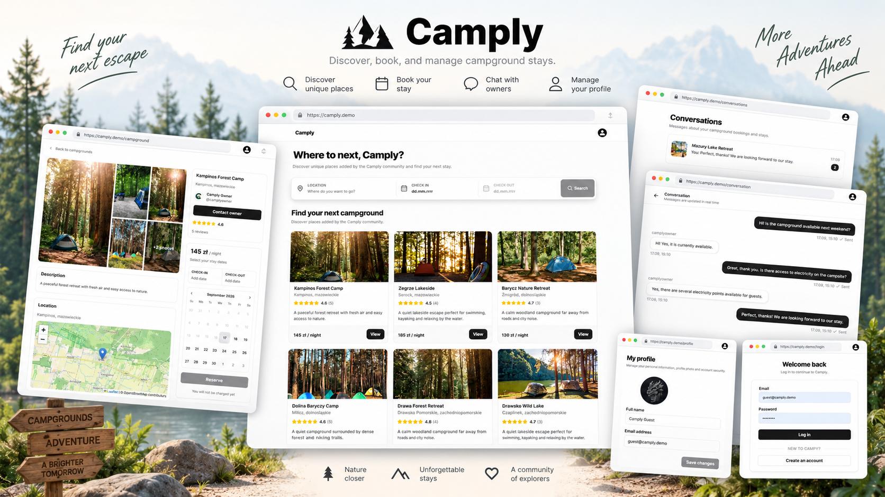
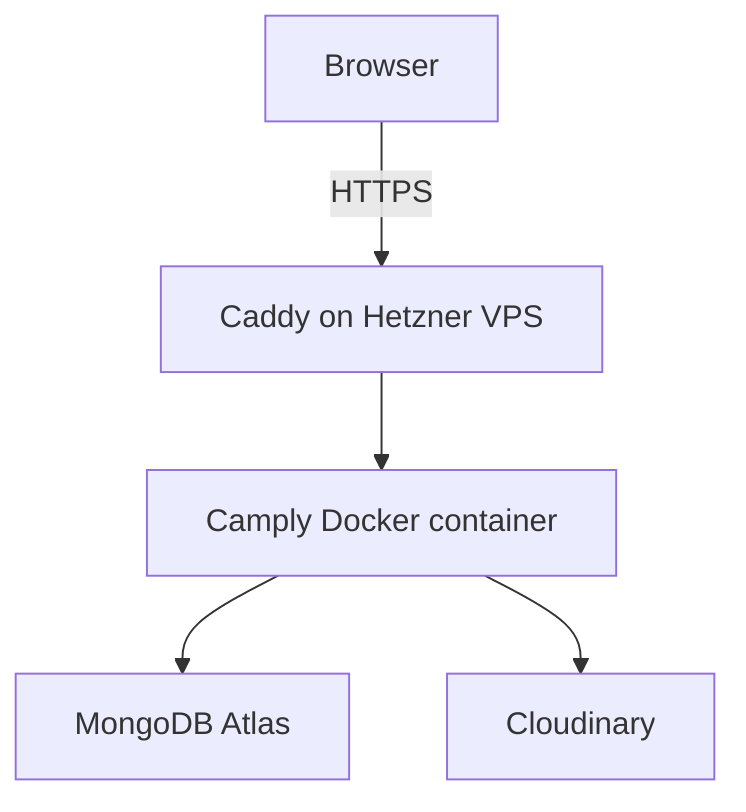

# Camply

[](https://github.com/konrad3211/camply-fullstack/actions/workflows/ci.yml)



Camply is a full-stack campground booking platform where users can discover campgrounds, make reservations, manage listings, leave reviews and communicate in real time.

The application is built with React, TypeScript, Express, MongoDB and Socket.IO. It is containerized with Docker and deployed as a single full-stack service on a Hetzner Cloud VPS, behind Caddy with HTTPS.

## Live Demo

**Live application:** https://camply.konradpatla.pl

### Demo accounts

**Campground owner**

```text
Email: owner@camply.demo
Password: Demo123!
```

**Guest**

```text
Email: guest@camply.demo
Password: Demo123!
```

These accounts contain demo campgrounds, reviews, bookings, conversations and messages so the main application flows can be explored immediately.

---

## Features

### Campgrounds

- Browse campground listings
- View detailed campground pages
- Search campgrounds by location and dates
- View listings created by a specific user
- Create, edit and delete campground listings
- Upload and manage campground images
- Interactive map integration
- Reviews and average ratings

### Booking system

- Select check-in and check-out dates
- Check campground availability
- Date overlap validation against existing bookings
- View personal reservations
- Cancel reservations
- Simulated payment flow
- Campground owners can view reservations for their listings
- Campground owners can block unavailable dates
- Campground owners can cancel reservations
- Booking statistics and revenue overview for campground owners

### Authentication and authorization

- User registration and login
- Short-lived JWT access tokens
- Refresh tokens stored in HTTP-only cookies
- Automatic session restoration
- Protected frontend routes
- Protected backend endpoints
- Resource ownership authorization

### Real-time messaging

- Conversations between campground owners and guests
- Real-time messaging with Socket.IO
- Live message notifications
- Unread message counts
- Read status handling

### UI and frontend

- Responsive interface
- Reusable loading and error states
- Form validation
- Toast notifications
- Interactive maps
- Date picker
- Route-based code splitting with `React.lazy()` and `Suspense`

---

## Tech Stack

### Frontend

- React 19
- TypeScript
- Vite
- React Router
- Tailwind CSS 4
- shadcn/ui / Base UI
- Zustand
- Axios
- React Hook Form
- Zod
- Leaflet / React Leaflet
- Socket.IO Client
- date-fns

### Backend

- Node.js 24
- Express 5
- MongoDB
- Mongoose
- Socket.IO
- JSON Web Tokens
- Zod
- Multer
- Cloudinary
- bcrypt

### Testing

- Vitest
- Supertest
- MongoDB Memory Server

Backend integration tests cover the main application flows, including authentication, campgrounds, bookings and conversations.

### DevOps

- Docker
- Multi-stage Docker build
- GitHub Actions CI
- Hetzner Cloud VPS
- Docker Compose
- Caddy reverse proxy with automatic HTTPS
- HTTP health endpoint

---

## Architecture

Camply is deployed as a single full-stack service.



The Camply container runs Express and Socket.IO and includes the compiled React frontend. In production, Express serves both the REST API and the frontend files.

API requests use the `/api` prefix, while frontend routes are handled by React Router through the SPA fallback.

---

## Project Structure

```text
camply-fullstack/
|
+-- backend/
|   +-- src/
|   |   +-- controllers/
|   |   +-- lib/
|   |   +-- middleware/
|   |   +-- models/
|   |   +-- routes/
|   |   +-- schemas/
|   |   +-- app.js
|   |   +-- index.js
|   +-- tests/
|   +-- seeds/
|   +-- package.json
|
+-- frontend/
|   +-- src/
|   |   +-- api/
|   |   +-- components/
|   |   +-- layouts/
|   |   +-- lib/
|   |   +-- pages/
|   |   +-- store/
|   |   +-- types/
|   +-- public/
|   +-- package.json
|
+-- screenshots/
|   +-- camply-preview.png
|
+-- .github/
|   +-- workflows/
|       +-- ci.yml
|
+-- Dockerfile
+-- .dockerignore
+-- README.md
```

---

## Local Development

### Requirements

- Node.js 24+
- npm
- MongoDB database
- Cloudinary account

Clone the repository:

```bash
git clone https://github.com/konrad3211/camply-fullstack.git
cd camply-fullstack
```

### Backend

```bash
cd backend
npm install
```

Create `backend/.env`:

```env
NODE_ENV=development
PORT=3000

MONGO_URI=your_mongodb_connection_string

JWT_ACCESS_SECRET=your_access_token_secret
JWT_REFRESH_SECRET=your_refresh_token_secret
JWT_ACCESS_EXPIRES_IN=15m
JWT_REFRESH_EXPIRES_IN=30d

CLOUDINARY_CLOUD_NAME=your_cloudinary_cloud_name
CLOUDINARY_KEY=your_cloudinary_api_key
CLOUDINARY_SECRET=your_cloudinary_api_secret

CLIENT_URL=http://localhost:5173
NOMINATIM_USER_AGENT=Camply/1.0
```

Start the backend:

```bash
npm run dev
```

The API runs at:

```text
http://localhost:3000
```

### Frontend

Open another terminal:

```bash
cd frontend
npm install
npm run dev
```

The frontend runs at:

```text
http://localhost:5173
```

---

## Database Seeding

The seed script resets the application data and creates a complete demo dataset containing users, campgrounds, reviews, bookings, conversations and messages.

> **Warning:** the seed script deletes existing application data before creating the demo dataset. Do not run it against a database containing data you want to keep.

Run:

```bash
cd backend
npm run seed
```

---

## Testing and Quality Checks

Run backend tests:

```bash
cd backend
npm test
```

Run backend tests in watch mode:

```bash
npm run test:watch
```

Run frontend linting:

```bash
cd frontend
npm run lint
```

Create a production frontend build:

```bash
npm run build
```

---

## Docker

Camply uses a multi-stage Docker build.

The first stage installs frontend dependencies and creates the Vite production build. The second stage installs production backend dependencies, copies the compiled frontend and starts the Express server.

Build the image:

```bash
docker build -t camply .
```

Run the container:

```bash
docker run --env-file backend/.env -p 3000:3000 camply
```

The complete application is then available at:

```text
http://localhost:3000
```

---

## Continuous Integration

GitHub Actions runs automatically on pushes and pull requests.

```text
Backend
+-- npm ci
+-- npm test

Frontend
+-- npm ci
+-- npm run lint
+-- npm run build
```

---

## Health Check

The production API exposes:

```http
GET /api/health
```

Example response:

```json
{
  "success": true,
  "message": "Server is healthy"
}
```

This endpoint can be used to check that the API responds after deployment. It is available at https://camply.konradpatla.pl/api/health.

---

## Deployment

The application runs on a Hetzner Cloud VPS using Docker Compose. Caddy handles HTTPS and forwards requests for `camply.konradpatla.pl` to the `camply` container on internal port `3000` over the shared Docker network `proxy`.

The repository is cloned to `/opt/apps/camply` on the VPS. The server-side Compose configuration loads runtime variables from `backend/.env` and sets `NODE_ENV=production`, `PORT=3000`, and `CLIENT_URL=https://camply.konradpatla.pl`.

Deployment is currently manual. GitHub Actions checks pushes and pull requests, but does not deploy changes to the VPS. After the checks pass, update the application on the server:

```bash
cd /opt/apps/camply
git pull --ff-only origin main
docker compose up -d --build
docker compose ps
docker compose logs --tail=60 camply
```

Verify the deployed API:

```bash
curl --fail https://camply.konradpatla.pl/api/health
```

---

## Security

- Password hashing with bcrypt
- JWT access and refresh token flow
- HTTP-only refresh token cookies
- Protected backend routes
- Resource ownership checks
- Server-side Zod validation
- Upload size and file count limits
- Environment variables for secrets and credentials

Secrets and credentials are not committed to the repository.

---

## Author

**Konrad Patla**

GitHub: https://github.com/konrad3211
